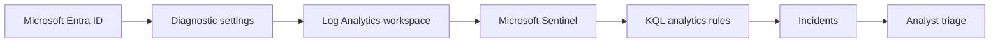
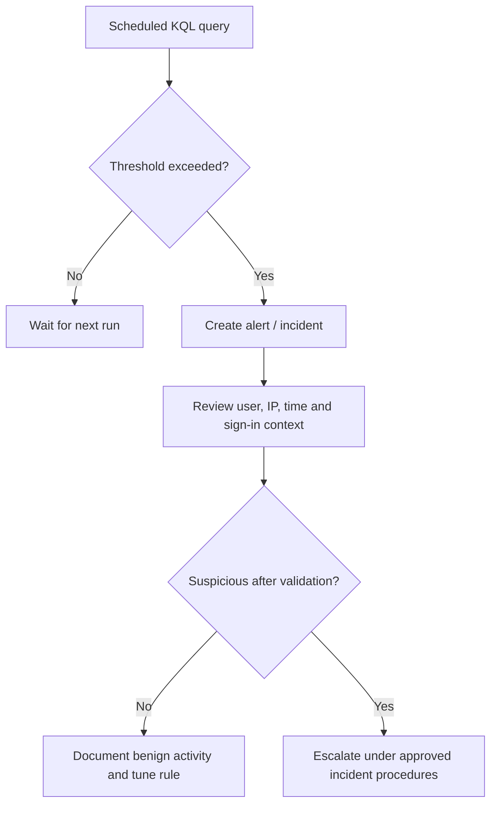

# Detection architecture

```mermaid
flowchart LR
    A[Microsoft Entra ID] --> B[Diagnostic settings]
    B --> C[Log Analytics workspace]
    C --> D[Microsoft Sentinel]
    D --> E[KQL analytics rules]
    E --> F[Incidents]
    F --> G[Analyst triage]
```

## Detection workflow

```mermaid
flowchart TD
    A[Scheduled KQL query] --> B{Threshold exceeded?}
    B -- No --> C[Wait for next run]
    B -- Yes --> D[Create alert / incident]
    D --> E[Review user, IP, time and sign-in context]
    E --> F{Suspicious after validation?}
    F -- No --> G[Document benign activity and tune rule]
    F -- Yes --> H[Escalate under approved incident procedures]
```

Architecture is conceptual; connectors, permissions, and data ingestion must be configured in a real tenant.
